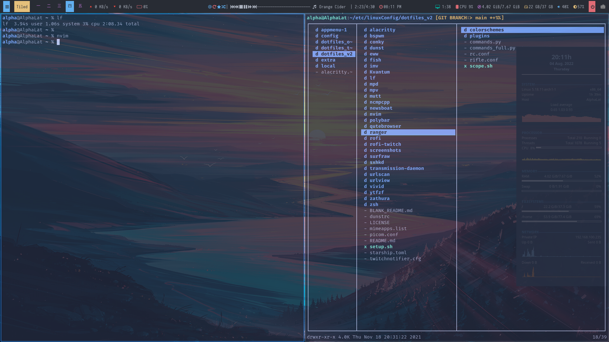

  
<br />
<div align="center">
  <a href="https://github.com/Zulqarnain-cc34/dotfiles">
    
  </a>

<h3 align="center">Dotfiles</h3>
  <p align="center">
    These are my linux configuration files, Hope you can find something to your liking.
  </p>
  <p align="center">
    <strong>⭐ If you find this useful, consider giving it a star!</strong>
  </p>
        
  <p align="center">
     Made with ❤️ by <a href="https://github.com/Zulqarnain-cc34">Zulqarnain</a>
  </p>
</div>


## 🖥️ System Overview

| Component         | Program                                          |
|-------------------|--------------------------------------------------|
| 🪟 Window Manager | [bspwm](https://github.com/baskerville/bspwm)    |
| 📊 Status Bar     | [polybar](https://github.com/polybar/polybar)    |
| ✏️ Editor         | [neovim](https://github.com/neovim/neovim)       |
| 💻 Terminal       | [kitty](https://github.com/kovidgoyal/kitty)     |
| 📧 Email Client   | [neomutt](https://github.com/neomutt/neomutt)    |
| 📰 RSS Reader     | [newsboat](https://github.com/newsboat/newsboat) |
| 📁 File Manager   | [lf](https://github.com/gokcehan/lf)             |
| 🚀 Launcher       | [rofi](https://github.com/davatorium/rofi)       |
| 🔽 Torrent        | [transmission](https://transmissionbt.com/)      |
| 🎬 Video Player   | [mpv](https://github.com/mpv-player/mpv)         |
| ✨ Compositor     | [picom](https://github.com/yshui/picom)          |
| 📈 System Monitor | [conky](https://github.com/brndnmtthws/conky)    |
| 🐚 Shell          | [zsh](https://www.zsh.org/)                      |

## Table of Contents

- [Overview](#overview)
- [Requirements](#requirements)
- [Installation](#installation)
- [Modules](#modules)

### 📋 Overview

This repository contains a curated collection of configuration files and dotfiles for a modern, efficient development setup.This setup prioritizes rapid prototyping, smooth CLI workflows, and deep integration with cutting-edge development tools in Linux.

**Key Features:**
- ⚡ **Neovim** configuration with LSP, DAP, and plugins optimized for AI/ML development
- 🔌 **Modular architecture** for easy customization and maintenance
- 🎯 **Shell configuration** (ZSH/Bash) with intelligent defaults and aliases
- 🖼️ **Terminal multiplexer** (Tmux) setup with ergonomic keybindings
- 🔄 **Automation workflows** using N8N, FastAPI, and custom scripts
- 📦 **Python development** optimized with virtual environments and debugging tools
- 🌐 **Git workflows** with enhanced aliases and utilities

### Requirements

You will need to install the above listed packages from your package manager.

### Installation

To install on your system ,just run setup.sh on your local linux
machine. It will create symbolic links for all the configuration files
to their appropriate locations.

- Clone the Repository.
- Run command to make symbolic links
  `chmod +x setup.sh` `bash setup.sh`
  script will come soon

### Modules

- [Desktop](#desktop)
- [Kitty](#kitty)
- [Polybar](#polybar)
- [Neovim](#neovim)
- [Rofi](#rofi)
- [Newsboat](#newsboat)
- [Miscellaneous](#miscellaneous)

#### Desktop

<p align="center">
    
</p>

#### Kitty 

- Custom shell prompt with
  [zsh](https://github.com/Zulqarnain-cc34/zsh).
- Vim like features and key bindings with [zsh](https://github.com/Zulqarnain-cc34/zsh).
- Background blur and transparency using
  [picom](https://github.com/yshui/picom).

#### Polybar

Custom tweaks on
[forest-theme](https://github.com/adi1090x/polybar-themes) and some
modules from
[polybar-scripts](https://github.com/polybar/polybar-scripts)

<p align="center">

</p>

#### Neovim

<p align="center">


</p>

##### Features

A fully-featured IDE-like configuration with ~70% of plugins lazy-loaded for fast startup.

**Features:**
- 🧠 **LSP** — Native [nvim-lspconfig](https://github.com/neovim/nvim-lspconfig) with linting, formatting, and code actions
- ⚡ **Autocompletion** — [nvim-compe](https://github.com/hrsh7th/nvim-compe) + [ultisnips](https://github.com/SirVer/ultisnips)
- 🔍 **Fuzzy Finder** — [telescope.nvim](https://github.com/nvim-telescope/telescope.nvim)
- 🌳 **Syntax Highlighting** — [treesitter](https://github.com/nvim-treesitter/nvim-treesitter)
- 📂 **File Explorer** — [nvim-tree](https://github.com/kyazdani42/nvim-tree.lua)
- 🎨 **Theme** — [tokyonight](https://github.com/ghifarit53/tokyonight-vim)
- 📊 **Statusline** — [lualine](https://github.com/hoob3rt/lualine.nvim)
- 📑 **Bufferline** — [nvim-bufferline](https://github.com/akinsho/nvim-bufferline.lua)
- ⌨️ **Keybinding Help** — [which-key](https://github.com/folke/which-key.nvim)
- 🏠 **Dashboard** — [dashboard-nvim](https://github.com/glepnir/dashboard-nvim)
- 🔧 **Git Integration** — [fugitive](https://github.com/tpope/vim-fugitive) + [gitgutter](https://github.com/airblade/vim-gitgutter)
- 💡 **LSP UI** — [lspsaga](https://github.com/glepnir/lspsaga.nvim)
- 💬 **Comments** — [nerdcommenter](https://github.com/preservim/nerdcommenter)
- 📓 **Notes** — [vimwiki](https://github.com/vimwiki/vimwiki)

📖 **[View Keybindings →](https://github.com/Zulqarnain-cc34/dotfiles/tree/main/nvim/README.md)**

#### Rofi

A window switcher, Application launcher and search engine launcher.
<br> Lots of
features to intergrate rofi more smoothly with 

- 🎬 [YouTube](https://github.com/pystardust/ytfzf) — Search and play videos
- 🌐 [Surfraw](https://github.com/gotbletu/dotfiles_v2/tree/master/normal_user/rofi/.config/rofi/launchers) — Search engines
- 📺 [Twitch](https://github.com/indeedwatson/rofi-twitch) — Browse live streams

A script to manage all of above in one menu. Themes have been used
from [rofi-themes](https://github.com/davatorium/rofi-themes.git) and
[rofi-collection](https://github.com/Murzchnvok/rofi-collection) .

#### Newsboat

Configuration has features

- Vim like key bindings
- integrated with `urlportal.sh` script to open url appropriately
  according to their extension.
- feeds update on cronjob every x minutes in time.

#### Miscellaneous

- Starship Prompt configured with `starship.toml` file.
- Conky light weight System Moniter with [Conky themes](https://github.com/juliojsb/jotack).
- `.Xmodmap` for unbinding and binding keys on a system level.
  package.
- urlportal.sh script to open files depending upon their extensions.

## 📂 Repository Structure

```
dotfiles/
├── alacritty/       # Alacritty terminal config
├── bspwm/           # Window manager config
├── conky/           # System monitor widgets
├── dunst/           # Notification daemon
├── eww/             # ElKowars Wacky Widgets
├── fish/            # Fish shell config
├── firefox/         # Firefox userChrome
├── kitty/           # Kitty terminal config
├── lf/              # lf file manager
├── mpd/             # Music Player Daemon
├── mpv/             # Video player config
├── mutt/            # Email client
├── ncmpcpp/         # MPD client
├── newsboat/        # RSS reader
├── nvim/            # Neovim (IDE setup)
├── polybar/         # Status bar
├── qutebrowser/     # Keyboard-driven browser
├── ranger/          # File manager
├── rofi/            # Application launcher
├── screenshots/     # Rice screenshots
├── sxhkd/           # Keybinding daemon
├── zathura/         # PDF viewer
├── zsh/             # Zsh shell config
└── ...
```

---

