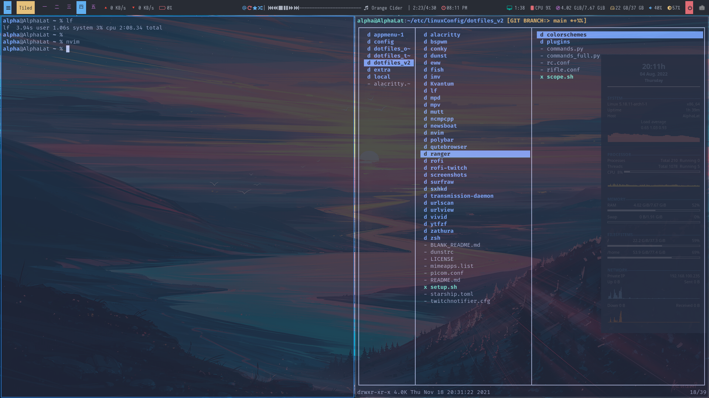
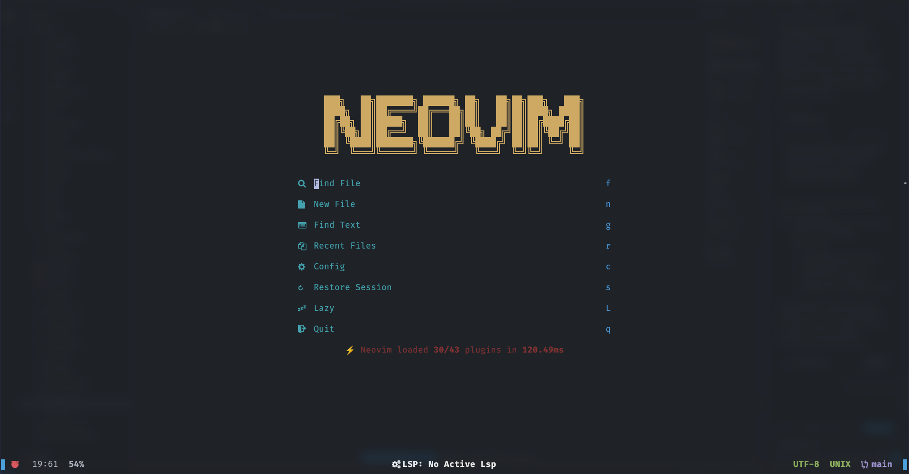
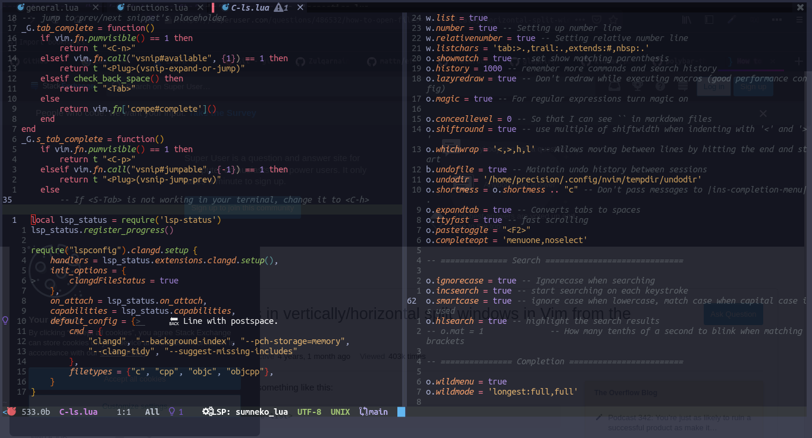
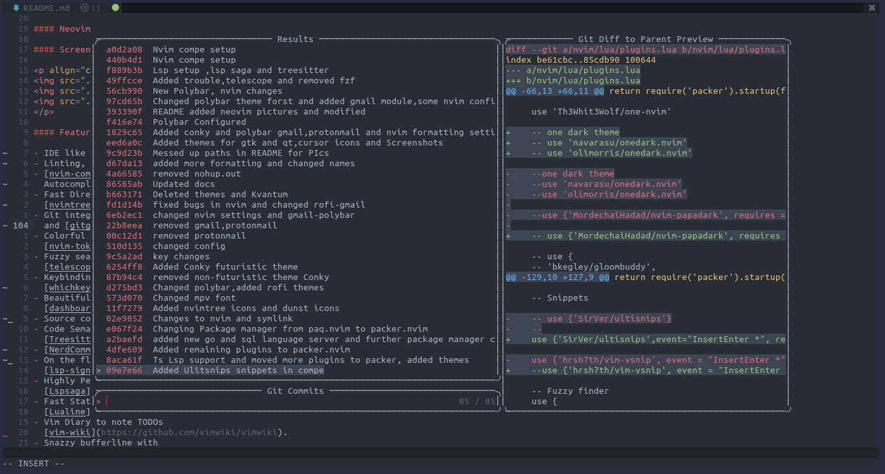
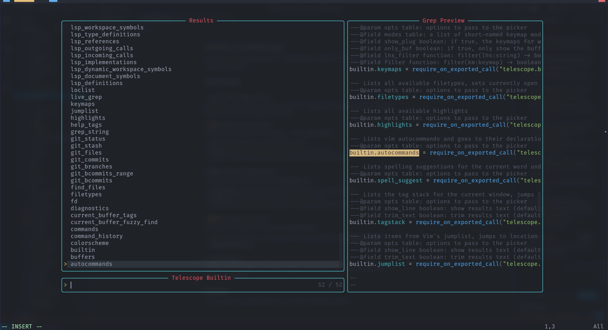
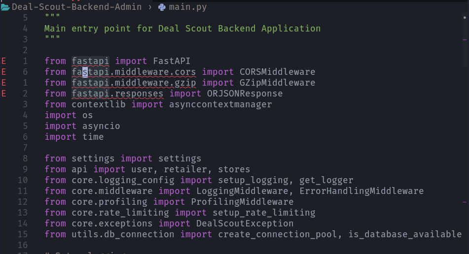
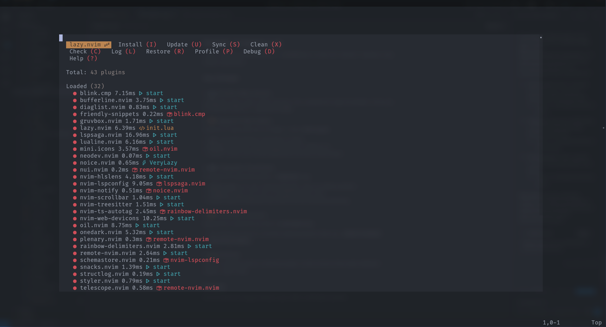

<div align="center">
  

  <h1 align="center">Dotfiles</h1>

  <p align="center">
    <b>Aesthetic. Functional. Fast.</b><br>
    <i>My personal configuration files for Linux, tuned for a seamless development workflow.</i>
  </p>

  <p align="center">
    <a href="https://github.com/Zulqarnain-cc34/dotfiles/stargazers"></a>
    <a href="https://github.com/Zulqarnain-cc34/dotfiles/network/members"></a>
    
    
  </p>
</div>

---

## 💻 The Rice

<p align="center">A breakdown of the core components powering this setup.</p>

<div align="center">

| **Category** | **Component** | **Details** |
| :--- | :--- | :--- |
| **OS** |  | The rolling release base. |
| **WM** |  | Binary Space Partitioning Window Manager. |
| **Bar** |  | Customized with specialized modules. |
| **Shell** |  | With `Starship` prompt & `autosuggestions`. |
| **Terminal** |  | GPU accelerated, highly configurable. |
| **Editor** |  | Full IDE replacement (~124ms startup). |
| **Launcher** |  | Application launcher & window switcher. |
| **Compositor** |  | For blurs, shadows, and transparency. |

</div>

---

## 🎨 Gallery

<div align="center">



<table>
  <tr>
    <td align="center" width="50%">
      
      <br><b>Neovim Dashboard</b>
    </td>
    <td align="center" width="50%">
      
      <br><b>Polybar Modules</b>
    </td>
  </tr>
  <tr>
    <td align="center" width="50%">
      
      <br><b>Coding Setup</b>
    </td>
    <td align="center" width="50%">
      
      <br><b>Telescope Finder</b>
    </td>
  </tr>
</table>

</div>

---

---

## ⚡ Benchmarks

Who doesn't love fast startup times?

| **Component** | **Command** | **Time** |
| :--- | :--- | :--- |
| **Neovim** | `nvim --startuptime` | **~125ms** 🚀 |
| **ZSH** | `zsh -i -c exit` | **0.143s** ⚡ |

---

## 🧠 Neovim Deep Dive

This isn't just a text editor; it's a personalized Development Environment.

<div align="center">
<table>
  <tr>
    <td align="center" width="50%">
      
      <br><b>Dashboard</b>
    </td>
    <td align="center" width="50%">
      
      <br><b>Telescope Finder</b>
    </td>
  </tr>
  <tr>
    <td align="center" width="50%">
      
      <br><b>LSP Code Actions</b>
    </td>
    <td align="center" width="50%">
      
      <br><b>Lazy Plugin Manager</b>
    </td>
  </tr>
</table>
</div>

### ✨ Key Features

- **🎯 LSP (Language Server Protocol)**:
  - Zero-config setup for `Python`, `Go`, `Lua`, `Rust`, `JS/TS`.
  - Auto-formatting on save.
  - Diagnostics and code actions.

- **🔭 Telescope**:
  - Blazing fast fuzzy finding for files, buffers, and text grep.
  - Pre-configured for custom dotfiles searching.

- **🌳 Treesitter**:
  - Advanced syntax highlighting.
  - Better indentation and folding.

- **🔌 Plugin Management**:
  - Uses [`lazy.nvim`](https://github.com/folke/lazy.nvim) for ultra-fast startup.
  - Plugins load **only** when needed (e.g., git plugins load only when opening a git file).

---

## ⌨️ Cheatsheets

<details open>
<summary><b>🪟 Window Manager (BSPWM)</b></summary>
<br>

| Keybinding | Action |
| :--- | :--- |
| **`Super + T`** | Open Terminal (Kitty) |
| **`Super + Space`** | App Launcher (Rofi) |
| **`Super + Q`** | Close Window |
| **`Super + H/J/K/L`** | Focus Window (Left/Down/Up/Right) |
| **`Super + Arrows`** | Move Floating Window |
| **`Super + D`** | Toggle Floating Mode |
| **`Super + F`** | Cycle Layout (fullscreen / monocle) |
| **`Super + V`** | Clipboard menu (clipmenu via rofi) |
| **`Super + P`** | Polybar power menu |
| **`Alt + L`** | Lock screen (slock) |
| **`Super + 1-8`** | Switch Workspaces |
| **`Super + Shift + 1-8`** | Send Window to Workspace |

Full list: [sxhkd/sxhkdrc](sxhkd/sxhkdrc)

</details>

<details open>
<summary><b>🚀 Apps & CLI Tools</b></summary>
<br>

| Keybinding | Action |
| :--- | :--- |
| **`Alt + N`** | Newsboat (RSS Reader) |
| **`Super + M`** | NCMPCPP (Music Player) |
| **`Super + W`** | Firefox |
| **`Super + E`** | Neomutt (Email) |
| **`Print`** | Screenshot (full screen) |
| **`Shift + Print`** | Screenshot (selection) |

</details>

---

## Primary stack

| Role | Tool | Notes |
|------|------|--------|
| Terminal | **Kitty** | `TERMINAL=kitty` in `.profile` |
| File manager | **Yazi** | Primary TUI |
| Launcher | **Rofi ribbon** | `super+space`; bulk themes removed |
| Legacy FM | lf, ranger | Optional; see `lf/README.md`, `ranger/README.md` |
| Alt terminal | Alacritty | Config kept; not primary |

External scripts under `~/bin/bash_scripts/` are documented in [scripts/host/README.md](scripts/host/README.md).

---

## 🚀 Installation

Full install guide: **[docs/INSTALL.md](docs/INSTALL.md)**

### Quick start (Arch Linux)

```bash
# GitHub repo is named dotfiles; local clone path is dotfiles_v2
git clone https://github.com/Zulqarnain-cc34/dotfiles.git ~/etc/linuxConfig/dotfiles_v2
cd ~/etc/linuxConfig/dotfiles_v2
chmod +x setup.sh scripts/*.sh
./scripts/install-deps.sh          # or install packages/minimal.txt by hand
./setup.sh --backup                # symlink configs; backs up existing targets
git config core.hooksPath .githooks
./scripts/validate.sh
```

Minimal package list (one Nerd font if disk is tight): `packages/minimal.txt`

> **Note:** `setup.sh` symlinks into `~/.config/` and `$HOME`. Use `--force` to replace existing targets. See [CHANGELOG.md](CHANGELOG.md) for notable repo changes.

---

## 📂 Structure

Everything is neatly organized in `~/.config/`:

```tree
dotfiles_v2/
├── bspwm/           # Window manager
├── polybar/         # Status bar
├── sxhkd/           # Global keybindings
├── nvim/            # Neovim (lazy.nvim)
├── zsh/             # Shell config
├── kitty/           # Primary terminal
├── yazi/            # Primary file manager
├── rofi/            # Launcher (ribbon)
├── dunst/           # Notifications
├── docs/            # INSTALL, secrets, firefox
├── scripts/         # setup helpers, validate, host stubs
├── packages/        # minimal.txt, v2 manifests
├── setup.sh         # Symlink deploy
└── picom.conf       # Compositor
```

---

<div align="center">
  <p>If you like this configuration, please give it a ⭐ star!</p>
  <p>Made with ❤️ by <a href="https://github.com/Zulqarnain-cc34">Zulqarnain</a></p>
</div>

