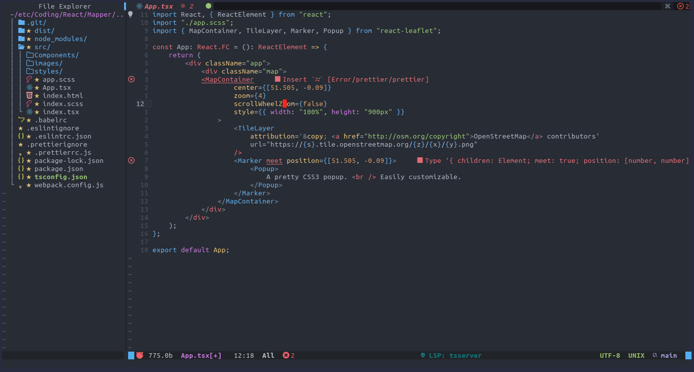

# Dotfiles

Zulqarnain-c34 [(Zulqarnain-cc34)](www.github.com/Zulqarnain-cc34)


Dotfiles for my local setup,


| functionality | program      |
|---------------|--------------|
| status bar    | polybar      |
| editor	    | neovim       |
| terminal      | alacritty    |
| email client  | neomutt      |
| rss reader    | newsboat     |
| file manager  | ranger       |
| launcher      | rofi         |
| torrent       | transmission |
| video player  | mpv          |

 ## Table of Contents

* [Requirements](#requirements)
* [Installation](#installation)
* [Modules](#modules)
	* [Alacritty](#alacritty)
	* [Polybar](#polybar)
	* [Neovim](#neovim)
	* [Ranger](#ranger)
	* [Rofi](#rofi)
	* [Newsboat](#newsboat)
	* [NeoMutt](#neomutt)
	* [Transmission](#transmission)
	* [Miscellaneous](#miscellaneous)

## Requirements


## Installation

To install on your system ,just run setup.sh on your local linux machine. It will create symbolic links for all the configuration files to their appropriate locations.

- git clone the repo
- Run command to make symbolic links
    ```
        chmod +x setup.sh
        bash setup.sh
    ```
- Run `bash uninstall.sh`, will remove all the config files.
uninstall script will come soon

## Modules

- [Alacritty](#alacritty)
- [Polybar](#polybar)
- [Neovim](#neovim)
- [Ranger](#ranger)
- [Rofi](#rofi)
- [Neomutt](#neomutt)
- [Newsboat](#newsboat)
- [Transmission](#transmission)
- [Miscellaneous](#miscellaneous)


### Alacritty
<p align="center">
   
</p>

#### Features

- Custom shell prompt with [Startship](https://github.com/starship/starship).
- Multiple Alacritty themes via [alacritty-themes](https://github.com/eendroroy/alacritty-theme) (i am using Argonaut).
- Background blur and transparency using [picom](https://github.com/yshui/picom).

### Polybar
Custom tweaks on [Adapta-theme-polybar](https://github.com/matoruru/polybar-adapta-theme) and some modules from [polybar-scripts](https://github.com/polybar/polybar-scripts)

<p align="center">
   
</p>

### Neovim
<p align="center">
   
</p>

#### Features

- Code autocompletion with [Coc.nvim](https://github.com/neoclide/coc.nvim) and [Snippets](https://github.com/neoclide/coc-snippets).
- Fast Directory traversal with [Nerdtree](https://github.com/preservim/nerdtree).
- Git integration with [fugitive](https://github.com/tpope/vim-fugitive) and [GitGutter](https://github.com/airblade/vim-gitgutter).
- Faster code commenting with [NerdCommentor](https://github.com/preservim/nerdcommenter).
- Colorful theme from [nvim-tokyonight](https://github.com/ghifarit53/tokyonight-vim).
- Fuzzy searcher and finder [fzf.vim](https://github.com/junegunn/fzf.vim).
- Keybinding Prompt with [whichkey](https://github.com/liuchengxu/vim-which-key).
- Beautiful dashboard via [dashboard-nvim](https://github.com/glepnir/dashboard-nvim).
- Source code linting and fixing using [Ale](https://github.com/dense-analysis/ale).
- Semantic highlighting for Python via [Semshi](https://github.com/numirias/semshi).
- Shorcuts and keybindings in [KeyBindins](https://github.com/Zulqarnain-cc34/dotfiles/tree/main/nvim/README.md)

### Ranger


### Rofi
using rofi as a custom launcher,ssh launcher and search engine. Lots of more scripts to integrate rofi with [twitch](https://github.com/indeedwatson/rofi-twitch), [youtube](https://github.com/pystardust/ytfzf), [surfraw](https://github.com/gotbletu/dotfiles_v2/tree/master/normal_user/rofi/.config/rofi/launchers) ,[wifi-menu](https://github.com/zbaylin/rofi-wifi-menu) ,[rofi-spotlight](https://github.com/manilarome/rofi-spotlight) and [others](https://github.com/gotbletu/dotfiles_v2/tree/master/normal_user/rofi/.config/rofi/launchers). Using rofi bangs script to manage all in one menu. Themes have been used from [rofi-themes](https://github.com/davatorium/rofi-themes.git) and [rofi-collection](https://github.com/Murzchnvok/rofi-collection) .

### Newsboat
Configuration has features

- Vim like key bindings
- integrated with `urlportal.sh` script to open url appropriately according to their extension.
- feeds update on cronjob every x minutes in time.

### NeoMutt
Setup with
- Aliases   `~/.mutt/aliases`  All the aliases are stored in aliases file.
- Colors    `~/.mutt/colors`   Color theme for neomutt.
- Settings  `~/.mutt/settings` Main config and personalized settings.
- Sidebar   `~/.mutt/sidebar`  Sidebar theme.
- muttrc    `~/.mutt/.muttrc`  All files are sourced in .muttrc as `source ./settings` and  `source ./aliases` etc.

Mutt themes are forked from [mutt-solarized-theme](https://github.com/altercation/mutt-colors-solarized) and [neon-mutt-theme](https://github.com/h3xx/mutt-colors-neonwolf)

### Transmission

### Miscellaneous

- Starship Prompt configured with `starship.toml` file.
- Themes for desktop in themes folder (I am using xfce4).
- `.Xmodmap` for unbinding and binding keys on a system level.
- `twitch notifer.cfg` to format output for [twitch-notifier](https://github.com/GiedriusS/TwitchNotifier) package.
- Coc settings configured in `nvim/coc-settings.json`.

Currently Under work

[(Back to top)](#top)
